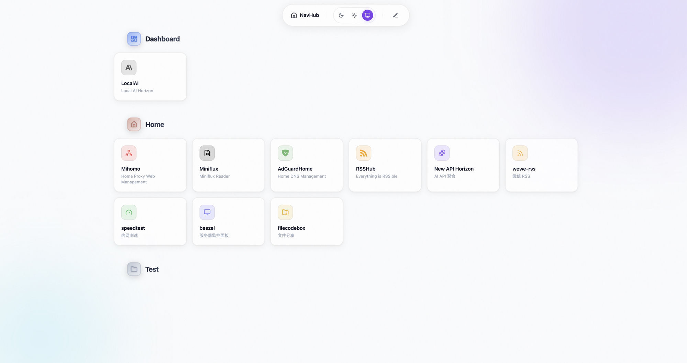

# NavHub

A self-hosted navigation dashboard to organize all your web services in one place. No more lost bookmarks, no more digging through browser history.



## Quick Start

```bash
# One-line Docker install
mkdir -p ~/navhub && cd ~/navhub
curl -O https://raw.githubusercontent.com/butfool/navhub/master/docker-compose.yml
docker compose up -d
```

Open http://localhost:57529 — that's it.

## Features

- **Category + Service cards** — organize by custom categories, each service has name, URL, description, icon and color
- **Drag to reorder** — categories and services can be reordered by drag-and-drop
- **Theme** — dark mode, light mode, or follow system preference
- **REST API** — all CRUD operations via HTTP, so you can script or automate anything
- **SQLite** — zero-dependency persistence, data stays local
- **Single binary** — ~17MB Docker image, no Node.js runtime needed

## Tech Stack

Go backend + React/Vite frontend, bundled into one binary. SQLite via pure Go (no CGO). Docker + GitHub Actions CI/CD.

## Configuration

| Variable | Default | Description |
|---|---|---|
| `PORT` | `3000` | HTTP port |
| `DATABASE_URL` | `file:/app/data/db.sqlite` | SQLite path |

## Local Development

```bash
# Backend
go run ./cmd/server

# Frontend (in another terminal)
cd web && npm install && npm run dev
```

Open http://localhost:3000. Vite proxies `/api` requests to the Go backend.

## Production Build

```bash
npm --prefix web run build
go build -o navhub ./cmd/server
./navhub
```

## API

```
GET    /api/categories
POST   /api/categories
PUT    /api/categories?id=<id>
DELETE /api/categories?id=<id>

GET    /api/services
POST   /api/services
PUT    /api/services?id=<id>
DELETE /api/services?id=<id>
```

The API validates required fields and blocks dangerous URL schemes (`javascript:`, `data:`, `vbscript:`).

## Security

NavHub is designed for trusted private networks. The dashboard and API have no built-in authentication. If you expose it outside a trusted environment, put it behind an auth proxy (Basic Auth, Cloudflare Access, OAuth, etc.).

## Project Structure

```
cmd/server/main.go         # Go server + embedded static assets
cmd/server/web/dist/      # Production frontend build
migrations/               # SQLite schema
web/src/                  # React source
```

## License

Apache 2.0